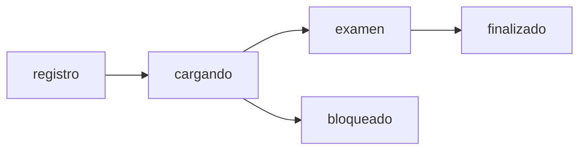

## Component Overview

The Examen App consists of 5 main React components, each serving a specific purpose in the application flow. All components use React Hooks for state management and Firebase for data persistence.

## App.jsx

<Info>
  **Location:** `src/App.jsx`  
  **Purpose:** Main routing component that configures all application routes
</Info>

### Implementation

```jsx src/App.jsx
import { BrowserRouter, Routes, Route } from 'react-router-dom';
import Examen from './Examen';
import PanelProfesor from './PanelProfesor';
import Home from './Home';

function App() {
  return (
    <BrowserRouter basename="/examen-app">
      <Routes>
        <Route path="/" element={<Home />} />
        <Route path="/examen/:id" element={<Examen />} />
        <Route path="/admin" element={<PanelProfesor />} />
      </Routes>
    </BrowserRouter>
  );
}
export default App;
```

### Key Features

<CardGroup cols={2}>
  <Card title="BrowserRouter" icon="route">
    Enables client-side routing with HTML5 history API
  </Card>
  
  <Card title="Basename" icon="link">
    Configured for GitHub Pages deployment
  </Card>
  
  <Card title="Dynamic Routes" icon="shuffle">
    Uses URL parameters for exam identification
  </Card>
  
  <Card title="Lazy Loading" icon="bolt">
    Ready for code splitting optimization
  </Card>
</CardGroup>

<Warning>
  The `basename` prop must match your repository name in GitHub Pages.
</Warning>

---

## Home.jsx

<Info>
  **Location:** `src/Home.jsx`  
  **Purpose:** Student-facing landing page with exam selection
</Info>

### Key Features

<AccordionGroup>
  <Accordion title="Exam Loading" icon="database">
    Fetches all available exams from Firestore on component mount:
    
    ```jsx
    useEffect(() => {
      const obtenerExamenes = async () => {
        const snap = await getDocs(collection(db, "examenes"));
        setExamenes(snap.docs.map(d => ({ id: d.id, ...d.data() })));
      };
      obtenerExamenes();
    }, []);
    ```
  </Accordion>

  <Accordion title="Theme System" icon="palette">
    Implements persistent theme selection with localStorage:
    
    ```jsx
    const THEMES = {
      claro: { bg: '#ffffff', text: '#333333', card: '#f0f0f0', border: '#cccccc' },
      oscuro: { bg: '#121212', text: '#e0e0e0', card: '#1e1e1e', border: '#333333' },
      calido: { bg: '#f5e6d3', text: '#4a3b2a', card: '#e8dcc5', border: '#d1c7b7' }
    };
    
    const [temaActual, setTemaActual] = useState(
      () => localStorage.getItem('temaApp') || 'claro'
    );
    ```
  </Accordion>

  <Accordion title="Responsive Grid" icon="grid">
    Auto-fitting grid layout for exam cards:
    
    ```jsx
    <div style={{ 
      display: 'grid', 
      gridTemplateColumns: 'repeat(auto-fit, minmax(280px, 1fr))',
      gap: '20px',
      width: '100%'
    }}>
    ```
  </Accordion>
</AccordionGroup>

### State Management

| State | Type | Purpose |
|-------|------|----------|
| `examenes` | Array | List of available exams |
| `temaActual` | String | Current theme ('claro', 'oscuro', 'calido') |

### UI Components

```jsx Exam Card Example
<Link 
  to={`/examen/${ex.id}`}
  style={{ 
    padding: '30px', 
    background: styles.card,
    borderRadius: '12px',
    boxShadow: '0 4px 6px rgba(0,0,0,0.1)',
    transition: 'transform 0.2s'
  }}
>
  <h3>📄 {ex.titulo}</h3>
  <p>Click para comenzar</p>
</Link>
```

---

## Examen.jsx

<Info>
  **Location:** `src/Examen.jsx`  
  **Purpose:** Complete exam-taking workflow with registration, questions, and results
</Info>

### Workflow Phases



### Phase: Registration

<AccordionGroup>
  <Accordion title="Student Registration Form" icon="user-plus">
    Collects student information with validation:
    
    ```jsx
    const UNIDADES_ACADEMICAS = [
      "Zongolica", "Tequila", "Nogales", 
      "Acultzinapa", "Cuichapa", "Tezonapa", "Tehuipango"
    ];
    
    const regexControl = /^\d{3}[Ww]\d{4}$/; // Format: 123W1041
    
    const validarControl = (v) => {
      setNumControl(v.toUpperCase());
      setErrorControl(
        !regexControl.test(v) ? 'Formato inválido (Ej: 123W1041)' : ''
      );
    };
    ```
  </Accordion>

  <Accordion title="Attempt Validation" icon="shield-check">
    Checks if student has remaining attempts:
    
    ```jsx
    const iniciarExamen = async () => {
      const q = query(
        collection(db, "resultados"),
        where("examenId", "==", id),
        where("numControl", "==", numControl.toUpperCase())
      );
      const snap = await getDocs(q);
      const intentos = snap.size;
      const maximos = examenInfo.intentosMaximos || 1;

      if (intentos >= maximos) { 
        setFase('bloqueado');
        return;
      }
    };
    ```
  </Accordion>
</AccordionGroup>

### Phase: Exam

<Steps>
  <Step title="Question Randomization">
    Shuffles questions and limits to configured amount:
    
    ```jsx
    const banco = examenInfo.preguntas || [];
    const barajadas = [...banco].sort(() => 0.5 - Math.random());
    const limite = examenInfo.limite && examenInfo.limite > 0 
      ? examenInfo.limite 
      : barajadas.length;
    setPreguntasAleatorias(barajadas.slice(0, limite));
    ```
  </Step>
  
  <Step title="Answer Selection">
    Tracks answers in state object:
    
    ```jsx
    <input 
      type="radio" 
      name={p.texto}
      onChange={() => setRespuestas({
        ...respuestas, 
        [p.texto]: op
      })}
    />
    ```
  </Step>
  
  <Step title="Submission">
    Calculates grade and saves to Firestore:
    
    ```jsx
    const enviarExamen = async () => {
      let aciertos = 0;
      preguntasAleatorias.forEach(p => {
        if (respuestas[p.texto] === p.correcta) aciertos++;
      });
      const nota = (aciertos / preguntasAleatorias.length) * 10;
      
      await addDoc(collection(db, "resultados"), { 
        examenId: id,
        nombre,
        numControl,
        calificacion: nota,
        fecha: new Date().toISOString()
      });
    };
    ```
  </Step>
</Steps>

### Phase: Results

<Tabs>
  <Tab title="Screen Display">
    Shows final grade with optional PDF generation:
    
    ```jsx
    <div className="no-print">
      <h1>¡Examen Enviado!</h1>
      <div style={{ fontSize: '4rem' }}>
        {calificacion.toFixed(1)}
      </div>
      
      {examenInfo.permitirImpresion && (
        <button onClick={() => window.print()}>
          📄 Descargar/Imprimir PDF
        </button>
      )}
    </div>
    ```
  </Tab>
  
  <Tab title="PDF Output">
    Printable results with detailed breakdown:
    
    ```jsx
    <div className="hoja-examen">
      <EncabezadoPDF 
        alumnoNombre={nombre}
        numControl={numControl}
        calificacion={calificacion}
      />
      
      <table>
        {preguntasAleatorias.map((p, idx) => {
          const esCorrecta = respuestas[p.texto] === p.correcta;
          return (
            <tr key={idx}>
              <td>{p.texto}</td>
              <td style={{ 
                color: esCorrecta ? 'black' : 'red' 
              }}>
                {respuestas[p.texto] || '(Sin responder)'}
              </td>
              <td>{p.correcta}</td>
            </tr>
          );
        })}
      </table>
    </div>
    ```
  </Tab>
</Tabs>

### State Variables

| State | Type | Purpose |
|-------|------|----------|
| `fase` | String | Current workflow phase |
| `nombre` | String | Student full name |
| `numControl` | String | Student ID (format: 123W1041) |
| `unidad` | String | Academic unit |
| `examenInfo` | Object | Exam metadata and questions |
| `preguntasAleatorias` | Array | Randomized question subset |
| `respuestas` | Object | Student answers (question → answer) |
| `calificacion` | Number | Final grade (0-10) |

---

## PanelProfesor.jsx

<Info>
  **Location:** `src/PanelProfesor.jsx`  
  **Purpose:** Comprehensive teacher admin panel for exam and result management
</Info>

### Authentication System

<AccordionGroup>
  <Accordion title="Login/Register" icon="lock">
    Firebase Authentication with whitelist validation:
    
    ```jsx
    const handleAuth = async (e) => {
      e.preventDefault();
      try {
        if (esRegistro) {
          // Check whitelist
          const q = query(
            collection(db, "docentes"),
            where("email", "==", email)
          );
          const querySnapshot = await getDocs(q);
          if (querySnapshot.empty) {
            setErrorLogin("❌ Correo no autorizado");
            return;
          }
          await createUserWithEmailAndPassword(auth, email, password);
        } else {
          await signInWithEmailAndPassword(auth, email, password);
        }
      } catch (error) {
        setErrorLogin(error.message);
      }
    };
    ```
  </Accordion>

  <Accordion title="Session Management" icon="user-shield">
    Monitors authentication state:
    
    ```jsx
    useEffect(() => {
      const unsubscribe = onAuthStateChanged(auth, (user) => {
        if (user) {
          setUsuario(user);
          cargarExamenes();
          cargarDocentes(user.email);
        } else {
          setUsuario(null);
        }
      });
      return () => unsubscribe();
    }, []);
    ```
  </Accordion>
</AccordionGroup>

### View Sections

<Tabs>
  <Tab title="Exámenes">
    **Exam Creation & Management**
    
    ```jsx Create Exam
    const crearExamen = async () => {
      await addDoc(collection(db, "examenes"), { 
        nombreExamen: nuevoNombreExamen,
        asignatura: nuevaAsignatura,
        titulo: `${nuevoNombreExamen} - ${nuevaAsignatura}`,
        unidad: nuevaUnidad,
        tema: nuevoTema,
        opcion: nuevaOpcion,
        preguntas: [],
        limite: 0,
        intentosMaximos: parseInt(nuevoIntentos),
        permitirImpresion: false,
        docenteNombre: docenteActual.nombre,
        docenteEmail: usuario.email
      });
    };
    ```
    
    **Question Management:**
    - Add/Edit/Delete questions
    - Import from CSV
    - Export to CSV
    - Pagination (5/10/20 per page)
  </Tab>
  
  <Tab title="Resultados">
    **Result Analytics**
    
    ```jsx Filter Results
    const resultadosFiltrados = useMemo(() => {
      return resultados.filter(r => {
        if (filtros.examenId && r.examenId !== filtros.examenId) 
          return false;
        if (filtros.numControl && 
            !r.numControl.includes(filtros.numControl.toUpperCase())) 
          return false;
        if (filtros.unidad && r.unidad !== filtros.unidad) 
          return false;
        return true;
      });
    }, [resultados, filtros]);
    ```
    
    **Features:**
    - Filter by exam, student ID, academic unit
    - Export to CSV
    - Grade visualization (color-coded)
  </Tab>
  
  <Tab title="Docentes">
    **Teacher Whitelist Management**
    
    ```jsx Add Teacher
    const guardarDocente = async () => {
      await addDoc(collection(db, "docentes"), {
        nombre: nuevoDocenteNombre,
        email: nuevoDocenteEmail,
        fechaRegistro: new Date().toISOString()
      });
      cargarDocentes(usuario.email);
    };
    ```
    
    **Features:**
    - Add authorized teachers
    - View teacher directory
    - Remove teacher access
  </Tab>
</Tabs>

### CSV Import/Export

<CodeGroup>
```csv Import Format
Pregunta,Op1,Op2,Op3,Op4,IndexCorrecta
"¿Cuál es la capital?","Madrid","París","Londres","Roma",1
"2 + 2 =","3","4","5","6",2
```

```javascript Import Handler
const handleImportarCSV = (e) => {
  const file = e.target.files[0];
  const reader = new FileReader();
  reader.onload = async (evt) => {
    const text = evt.target.result;
    const lines = text.split('\n');
    const nuevasPreguntas = [];
    
    lines.forEach((line) => {
      const cols = line.split(',');
      if (cols.length >= 6) {
        const opciones = [
          cols[1].trim(), cols[2].trim(),
          cols[3].trim(), cols[4].trim()
        ];
        const correctaIdx = parseInt(cols[5].trim());
        nuevasPreguntas.push({
          texto: cols[0].trim(),
          opciones,
          correcta: opciones[correctaIdx - 1]
        });
      }
    });
    
    await updateDoc(doc(db, "examenes", examenSeleccionado), {
      preguntas: arrayUnion(...nuevasPreguntas)
    });
  };
  reader.readAsText(file);
};
```
</CodeGroup>

### Print Modes

<CardGroup cols={2}>
  <Card title="Blank Exam" icon="file">
    Prints all questions with empty answer circles for paper exams
  </Card>
  
  <Card title="Answer Key" icon="key">
    Prints questions with correct answers highlighted
  </Card>
</CardGroup>

---

## EncabezadoPDF.jsx

<Info>
  **Location:** `src/EncabezadoPDF.jsx`  
  **Purpose:** Reusable PDF header component for exam results
</Info>

### Props Interface

```typescript
interface EncabezadoPDFProps {
  // Exam metadata
  asignatura: string;
  unidad?: string;
  tema?: string;
  opcion?: 'diagnostico' | '1ra' | '2da';
  docenteNombre?: string;
  
  // Student information
  alumnoNombre?: string;
  numControl?: string;
  unidadAcademica?: string;
  calificacion?: number;
  fecha?: string;
}
```

### Implementation

```jsx src/EncabezadoPDF.jsx
import logoInstitucional from './images/LOGOS.png';

export default function EncabezadoPDF({
  asignatura, unidad, tema, opcion,
  alumnoNombre, numControl, unidadAcademica,
  calificacion, fecha, docenteNombre
}) {
  const CARRERA = "Ingeniería en Sistemas Computacionales";
  const fechaStr = fecha 
    ? new Date(fecha).toLocaleDateString('es-MX') 
    : "___/___/___";

  const isDiag = opcion === 'diagnostico' ? 'X' : '_';
  const is1ra = opcion === '1ra' ? 'X' : '_';
  const is2da = opcion === '2da' ? 'X' : '_';

  return (
    <div style={{ width: '100%', fontFamily: 'Arial, sans-serif' }}>
      {/* Logo and title */}
      <div style={{ display: 'flex', alignItems: 'center' }}>
        
        <div style={{ textAlign: 'center', flexGrow: 1 }}>
          <h3>Instituto Tecnológico Superior de Zongolica</h3>
        </div>
      </div>
      
      {/* Official table with exam and student info */}
      <table style={{ width: '100%', borderCollapse: 'collapse' }}>
        <tbody>
          <tr>
            <td colSpan="4">
              <strong>Asignatura:</strong> {asignatura}
            </td>
          </tr>
          <tr>
            <td colSpan="4" style={{ textAlign: 'center' }}>
              <strong>Opción:</strong>
              Diagnóstico ( <strong>{isDiag}</strong> )
              1ª oportunidad ( <strong>{is1ra}</strong> )
              2ª oportunidad ( <strong>{is2da}</strong> )
            </td>
          </tr>
          <tr>
            <td colSpan="2"><strong>Docente:</strong> {docenteNombre}</td>
          </tr>
          <tr>
            <td>{alumnoNombre}</td>
            <td>{numControl}</td>
            <td>{fechaStr}</td>
            <td><strong>{calificacion?.toFixed(1)}</strong></td>
          </tr>
        </tbody>
      </table>
    </div>
  );
}
```

### Usage Examples

<CodeGroup>
```jsx Student Results
<EncabezadoPDF 
  asignatura={examenInfo.titulo}
  alumnoNombre={nombre}
  numControl={numControl}
  unidadAcademica={unidad}
  calificacion={calificacion}
  fecha={new Date().toISOString()}
/>
```

```jsx Teacher Print (No Student Data)
<EncabezadoPDF 
  asignatura={ex.asignatura}
  unidad={ex.unidad}
  tema={ex.tema}
  opcion={ex.opcion}
  docenteNombre={ex.docenteNombre}
/>
```
</CodeGroup>

---

## Shared Patterns

### Theme System

All components use consistent theme structure:

```jsx
const THEMES = {
  claro: { 
    bg: '#ffffff', 
    text: '#333333', 
    card: '#f9f9f9', 
    border: '#dddddd', 
    accent: '#007bff' 
  },
  oscuro: { 
    bg: '#1e1e1e', 
    text: '#e0e0e0', 
    card: '#2d2d2d', 
    border: '#444444', 
    accent: '#4dabf7' 
  },
  calido: { 
    bg: '#f5e6d3', 
    text: '#4a3b2a', 
    card: '#e8dcc5', 
    border: '#d1c7b7', 
    accent: '#a67c52' 
  }
};
```

### LocalStorage Persistence

```jsx
const [temaActual, setTemaActual] = useState(
  () => localStorage.getItem('temaApp') || 'claro'
);

useEffect(() => {
  localStorage.setItem('temaApp', temaActual);
}, [temaActual]);
```

### Print Styling

<CodeGroup>
```css CSS Classes
.no-print {
  /* Hidden during print */
}

.hoja-examen {
  /* Visible only during print */
  display: none;
}

@media print {
  .no-print { display: none !important; }
  .hoja-examen { display: block !important; }
}
```
</CodeGroup>

<Check>
  All components follow consistent patterns for themes, state management, and Firebase integration.
</Check>