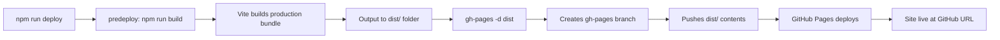

## Overview

The Examen App is configured for automatic deployment to GitHub Pages using the `gh-pages` package. This guide covers the deployment process, configuration, and troubleshooting.

## GitHub Pages Configuration

GitHub Pages is a free hosting service that serves static files directly from your repository. The app is currently deployed at:

```
https://eric-vc.github.io/examen-app/
```

## Prerequisites

<Steps>
  <Step title="GitHub Repository">
    Ensure your code is pushed to a GitHub repository:

    ```bash
    git remote -v
    # Should show your GitHub repository URL
    ```
  </Step>

  <Step title="Install Dependencies">
    The `gh-pages` package should already be installed:

    <CodeGroup>
    ```bash npm
    npm install
    ```

    ```bash yarn
    yarn install
    ```
    </CodeGroup>

    Verify `gh-pages` is in your dependencies:

    ```json package.json
    {
      "devDependencies": {
        "gh-pages": "^6.3.0"
      }
    }
    ```
  </Step>

  <Step title="Configure Repository Settings">
    1. Go to your GitHub repository
    2. Navigate to **Settings** > **Pages**
    3. Under "Source", select **Deploy from a branch**
    4. Choose the `gh-pages` branch and `/ (root)` folder
    5. Click **Save**
  </Step>
</Steps>

## Deployment Scripts

The `package.json` includes pre-configured deployment scripts:

```json package.json
{
  "homepage": "https://eric-vc.github.io/examen-app/",
  "scripts": {
    "predeploy": "npm run build",
    "deploy": "gh-pages -d dist",
    "build": "vite build",
    "dev": "vite",
    "preview": "vite preview"
  }
}
```

### Script Breakdown

| Script | Purpose |
|--------|--------|
| `predeploy` | Automatically runs before `deploy` - builds the production bundle |
| `deploy` | Deploys the `dist` folder to the `gh-pages` branch |
| `build` | Creates an optimized production build in the `dist` folder |
| `preview` | Preview the production build locally before deploying |

## Deployment Process

<Steps>
  <Step title="Build Locally (Optional)">
    Test the production build locally before deploying:

    <CodeGroup>
    ```bash npm
    npm run build
    npm run preview
    ```

    ```bash yarn
    yarn build
    yarn preview
    ```
    </CodeGroup>

    This starts a local server at `http://localhost:4173` to preview your production build.
  </Step>

  <Step title="Deploy to GitHub Pages">
    Run the deployment command:

    <CodeGroup>
    ```bash npm
    npm run deploy
    ```

    ```bash yarn
    yarn deploy
    ```
    </CodeGroup>

    This command will:
    1. Run `predeploy` (builds your app)
    2. Create or update the `gh-pages` branch
    3. Push the `dist` folder contents to that branch
    4. Trigger GitHub Pages deployment
  </Step>

  <Step title="Verify Deployment">
    1. Check the **Actions** tab in your GitHub repository
    2. Wait for the "pages build and deployment" workflow to complete
    3. Visit your site at `https://[username].github.io/[repo-name]/`
    4. Verify all routes work correctly:
       - Home page: `/`
       - Exam page: `/examen/:id`
       - Admin panel: `/admin`
  </Step>
</Steps>

<Note>
  The first deployment may take 5-10 minutes. Subsequent deployments are typically faster (1-2 minutes).
</Note>

## Required Configuration

For GitHub Pages deployment to work correctly, ensure these configurations are properly set:

### 1. Base Path Configuration

**vite.config.js**

```javascript vite.config.js
import { defineConfig } from 'vite'
import react from '@vitejs/plugin-react'

export default defineConfig({
  plugins: [react()],
  base: '/examen-app/' // IMPORTANT: Must match your repo name
})
```

<Warning>
  The `base` path must match your GitHub repository name exactly, including the trailing slash.
</Warning>

### 2. Router Basename

**src/App.jsx**

```jsx src/App.jsx
import { BrowserRouter, Routes, Route } from 'react-router-dom';

function App() {
  return (
    <BrowserRouter basename="/examen-app"> {/* Must match base path */}
      <Routes>
        <Route path="/" element={<Home />} />
        <Route path="/examen/:id" element={<Examen />} />
        <Route path="/admin" element={<PanelProfesor />} />
      </Routes>
    </BrowserRouter>
  );
}
```

### 3. Package Homepage

**package.json**

```json package.json
{
  "homepage": "https://eric-vc.github.io/examen-app/"
}
```

## Deployment Workflow

The deployment process follows this workflow:



## Build Output

The `vite build` command creates an optimized production build:

```bash
dist/
├── assets/
│   ├── index-[hash].js      # Application JavaScript bundle
│   ├── index-[hash].css     # Application styles
│   └── vendor-[hash].js     # Third-party dependencies
├── index.html               # Entry HTML file
└── vite.svg                 # Static assets
```

<Note>
  Vite automatically adds content hashes to filenames for optimal caching.
</Note>

## Custom Domain (Optional)

To use a custom domain with GitHub Pages:

<Steps>
  <Step title="Add CNAME file">
    Create a `public/CNAME` file in your project:

    ```text public/CNAME
    your-domain.com
    ```

    Vite will copy this to the `dist` folder during build.
  </Step>

  <Step title="Configure DNS">
    Add DNS records at your domain provider:

    **For apex domain (example.com):**
    ```
    A     185.199.108.153
    A     185.199.109.153
    A     185.199.110.153
    A     185.199.111.153
    ```

    **For subdomain (www.example.com):**
    ```
    CNAME    [username].github.io.
    ```
  </Step>

  <Step title="Update configuration">
    Modify `vite.config.js` to remove the base path:

    ```javascript
    export default defineConfig({
      plugins: [react()],
      base: '/' // Remove repo-specific base path
    })
    ```

    And update `src/App.jsx`:

    ```jsx
    <BrowserRouter basename="/"> {/* Root path for custom domain */}
    ```
  </Step>
</Steps>

## Continuous Deployment

For automatic deployments on every push, set up GitHub Actions:

<Steps>
  <Step title="Create workflow file">
    Create `.github/workflows/deploy.yml`:

    ```yaml .github/workflows/deploy.yml
    name: Deploy to GitHub Pages

    on:
      push:
        branches:
          - main

    permissions:
      contents: write

    jobs:
      deploy:
        runs-on: ubuntu-latest
        steps:
          - uses: actions/checkout@v4
          
          - name: Setup Node.js
            uses: actions/setup-node@v4
            with:
              node-version: '20'
              cache: 'npm'
          
          - name: Install dependencies
            run: npm ci
          
          - name: Build
            run: npm run build
          
          - name: Deploy to GitHub Pages
            uses: peaceiris/actions-gh-pages@v3
            with:
              github_token: ${{ secrets.GITHUB_TOKEN }}
              publish_dir: ./dist
    ```
  </Step>

  <Step title="Push workflow">
    Commit and push the workflow file:

    ```bash
    git add .github/workflows/deploy.yml
    git commit -m "Add GitHub Actions deployment workflow"
    git push
    ```
  </Step>

  <Step title="Verify automation">
    1. Make a change to your code
    2. Push to the `main` branch
    3. Check the **Actions** tab to see the automatic deployment
  </Step>
</Steps>

## Troubleshooting

<AccordionGroup>
  <Accordion title="404 errors on page refresh">
    GitHub Pages doesn't support client-side routing by default. Solutions:

    1. **Use Hash Router** (Quick fix):
    ```jsx
    import { HashRouter } from 'react-router-dom';
    
    function App() {
      return (
        <HashRouter>
          {/* routes */}
        </HashRouter>
      );
    }
    ```

    2. **Add 404.html** (Better UX):
    Create `public/404.html` that redirects to index.html:
    ```html
    <!DOCTYPE html>
    <html>
      <head>
        <script>
          sessionStorage.redirect = location.href;
        </script>
        <meta http-equiv="refresh" content="0;URL='/examen-app/'">
      </head>
    </html>
    ```
  </Accordion>

  <Accordion title="Assets not loading (404 for CSS/JS)">
    The `base` path in `vite.config.js` doesn't match your repository name:

    1. Check your repo name on GitHub
    2. Update `base: '/your-repo-name/'` in vite.config.js
    3. Update `basename` in BrowserRouter to match
    4. Rebuild and redeploy
  </Accordion>

  <Accordion title="Deployment fails with permission error">
    The `gh-pages` package needs push permissions:

    1. Ensure you're authenticated with GitHub
    2. Try: `git config --global user.email "your@email.com"`
    3. Try: `git config --global user.name "Your Name"`
    4. Or use a personal access token (PAT)
  </Accordion>

  <Accordion title="Old version still showing after deploy">
    Browser caching or GitHub Pages CDN delay:

    1. Hard refresh: `Ctrl+Shift+R` (Windows) or `Cmd+Shift+R` (Mac)
    2. Clear browser cache
    3. Wait 5-10 minutes for CDN propagation
    4. Check the actual commit hash in the gh-pages branch
  </Accordion>

  <Accordion title="Firebase not working after deployment">
    Check Firebase authentication settings:

    1. Go to Firebase Console > Authentication > Settings
    2. Add your GitHub Pages domain to authorized domains:
       `your-username.github.io`
    3. Save and redeploy if needed
  </Accordion>
</AccordionGroup>

## Rollback a Deployment

To revert to a previous version:

```bash
# View commit history of gh-pages branch
git log gh-pages

# Reset to a previous commit
git checkout gh-pages
git reset --hard <commit-hash>
git push origin gh-pages --force
```

<Warning>
  Use force push carefully. Ensure you have the correct commit hash before proceeding.
</Warning>

## Build Optimization

### Analyze Bundle Size

```bash
npm run build -- --mode=analyze
```

Or install the rollup visualizer:

```bash
npm install --save-dev rollup-plugin-visualizer
```

```javascript vite.config.js
import { visualizer } from 'rollup-plugin-visualizer';

export default defineConfig({
  plugins: [
    react(),
    visualizer({ open: true })
  ]
});
```

### Performance Tips

<CardGroup cols={2}>
  <Card title="Code Splitting" icon="scissors">
    Use React.lazy() for route-based code splitting to reduce initial bundle size
  </Card>
  
  <Card title="Image Optimization" icon="image">
    Compress images and use modern formats (WebP) for faster loading
  </Card>
  
  <Card title="Tree Shaking" icon="tree">
    Import only what you need from libraries to reduce bundle size
  </Card>
  
  <Card title="CDN for Assets" icon="cloud">
    Host large assets on a CDN for improved performance
  </Card>
</CardGroup>

## Monitoring

Monitor your deployed application:

1. **GitHub Pages Status**: Check Settings > Pages for deployment status
2. **Actions Tab**: Monitor build and deployment workflows
3. **Firebase Console**: Track authentication and database usage
4. **Browser DevTools**: Check for console errors and network issues

## Next Steps

<CardGroup cols={2}>
  <Card title="Firebase Setup" icon="fire" href="./firebase-setup">
    Configure backend services for your deployed app
  </Card>
  <Card title="Environment Variables" icon="gear" href="./environment-variables">
    Set up environment-specific configuration
  </Card>
</CardGroup>