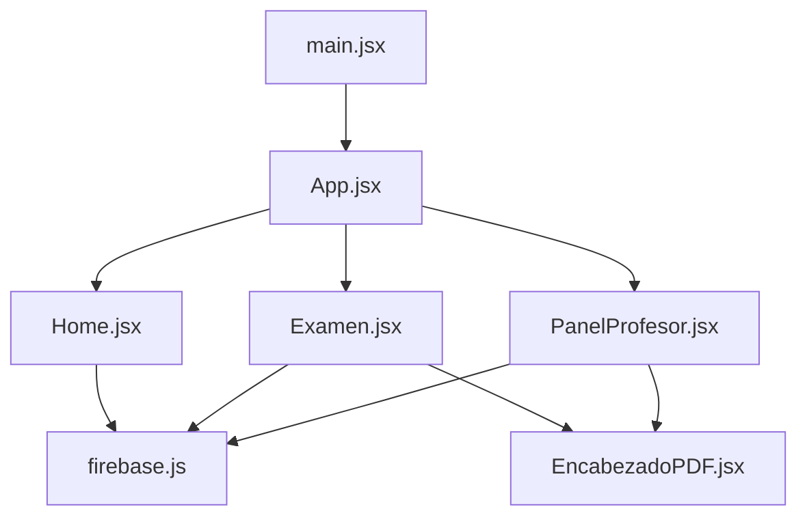

## Overview

The Examen App is built with React and Vite, following a modern frontend architecture with Firebase integration for backend services. The project uses a flat component structure with clear separation of concerns.

## Directory Structure

<CodeGroup>
```text Project Root
examen-app/
├── public/                 # Static assets
├── src/                    # Source code
│   ├── images/            # Image assets (logos, etc.)
│   ├── App.jsx            # Main routing component
│   ├── Home.jsx           # Student home page
│   ├── Examen.jsx         # Exam taking interface
│   ├── PanelProfesor.jsx  # Admin panel
│   ├── EncabezadoPDF.jsx  # PDF header component
│   ├── firebase.js        # Firebase configuration
│   ├── main.jsx           # Application entry point
│   ├── App.css            # Global styles
│   └── index.css          # Base styles
├── index.html             # HTML template
├── package.json           # Dependencies
├── vite.config.js         # Vite configuration
└── eslint.config.js       # ESLint configuration
```
</CodeGroup>

## Core Files

### Entry Point

<AccordionGroup>
  <Accordion title="main.jsx" icon="play">
    The application entry point that renders the root React component:
    
    ```jsx src/main.jsx
    import { StrictMode } from 'react'
    import { createRoot } from 'react-dom/client'
    import './index.css'
    import App from './App.jsx'

    createRoot(document.getElementById('root')).render(
      <StrictMode>
        <App />
      </StrictMode>,
    )
    ```
    
    <Note>
      Uses React 19's `createRoot` API for improved performance.
    </Note>
  </Accordion>

  <Accordion title="index.html" icon="code">
    The HTML template that hosts the React application:
    
    ```html index.html
    <!doctype html>
    <html lang="en">
      <head>
        <meta charset="UTF-8" />
        <link rel="icon" type="image/svg+xml" href="/vite.svg" />
        <meta name="viewport" content="width=device-width, initial-scale=1.0" />
        <title>examen-app</title>
      </head>
      <body>
        <div id="root"></div>
        <script type="module" src="/src/main.jsx"></script>
      </body>
    </html>
    ```
  </Accordion>
</AccordionGroup>

## Configuration Files

### Vite Configuration

<CodeGroup>
```javascript vite.config.js
import { defineConfig } from 'vite'
import react from '@vitejs/plugin-react'

export default defineConfig({
  plugins: [react()],
  base: '/examen-app/' // GitHub Pages base path
})
```
</CodeGroup>

<Warning>
  The `base` path must match your GitHub repository name for proper deployment.
</Warning>

### Package Dependencies

<Tabs>
  <Tab title="Production">
    **Core Dependencies:**
    - `react` (v19.2.0) - UI library
    - `react-dom` (v19.2.0) - DOM rendering
    - `react-router-dom` (v7.13.0) - Client-side routing
    - `firebase` (v12.8.0) - Backend services (Firestore, Auth)
  </Tab>
  
  <Tab title="Development">
    **Dev Dependencies:**
    - `vite` (v7.2.4) - Build tool
    - `@vitejs/plugin-react` - Vite React plugin
    - `eslint` - Code linting
    - `gh-pages` (v6.3.0) - GitHub Pages deployment
  </Tab>
</Tabs>

## Source Code Organization

### Component Hierarchy



### Routing Structure

The application uses React Router for navigation:

| Route | Component | Purpose |
|-------|-----------|----------|
| `/` | `Home.jsx` | Student exam selection |
| `/examen/:id` | `Examen.jsx` | Exam taking interface |
| `/admin` | `PanelProfesor.jsx` | Teacher admin panel |

<Info>
  All routes are configured in `App.jsx` with `BrowserRouter` and a basename for GitHub Pages deployment.
</Info>

## Asset Management

### Images

Images are stored in `src/images/` and imported directly:

```jsx Example
import logoInstitucional from './images/LOGOS.png';
```

### Styles

<CardGroup cols={2}>
  <Card title="index.css" icon="paintbrush">
    Base styles and CSS reset
  </Card>
  
  <Card title="App.css" icon="palette">
    Global application styles
  </Card>
  
  <Card title="Inline Styles" icon="code">
    Component-specific styling (primary approach)
  </Card>
  
  <Card title="Print Styles" icon="print">
    `.hoja-examen` and `.no-print` classes
  </Card>
</CardGroup>

## Build Output

### Development

```bash
npm run dev
```

Starts Vite dev server with hot module replacement at `http://localhost:5173`.

### Production

```bash
npm run build
```

Generates optimized static files in the `dist/` directory:

```text
dist/
├── assets/
│   ├── index-[hash].js
│   └── index-[hash].css
└── index.html
```

## Deployment Configuration

<Steps>
  <Step title="Build">
    Run `npm run build` to create production bundle
  </Step>
  
  <Step title="Deploy">
    Run `npm run deploy` to publish to GitHub Pages
  </Step>
  
  <Step title="Access">
    Application available at `https://[username].github.io/examen-app/`
  </Step>
</Steps>

<Note>
  The `gh-pages` package automatically pushes the `dist/` folder to the `gh-pages` branch.
</Note>

## Best Practices

<CardGroup cols={2}>
  <Card title="Component Files" icon="puzzle-piece">
    One component per file with matching filename and component name
  </Card>
  
  <Card title="Firebase Config" icon="shield">
    Centralized Firebase configuration in `firebase.js`
  </Card>
  
  <Card title="Route Organization" icon="route">
    All routes defined in single `App.jsx` file
  </Card>
  
  <Card title="Asset Imports" icon="image">
    Use ES6 imports for all static assets
  </Card>
</CardGroup>

<Check>
  The project structure follows React and Vite best practices for optimal performance and maintainability.
</Check>